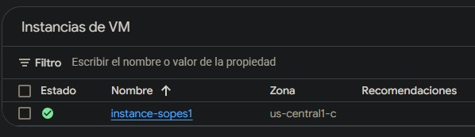
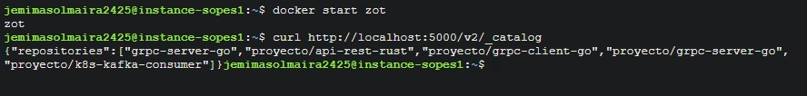
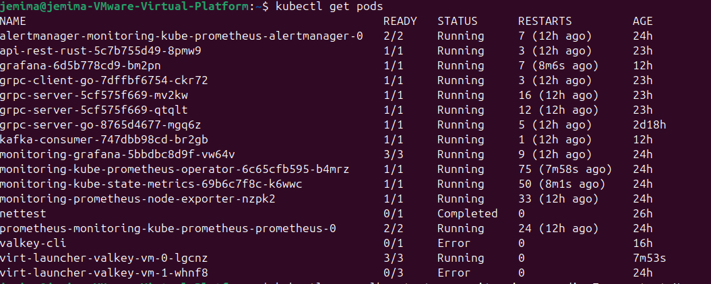
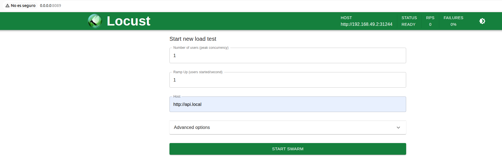
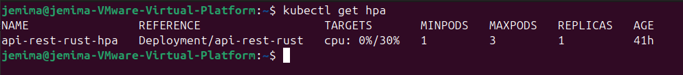
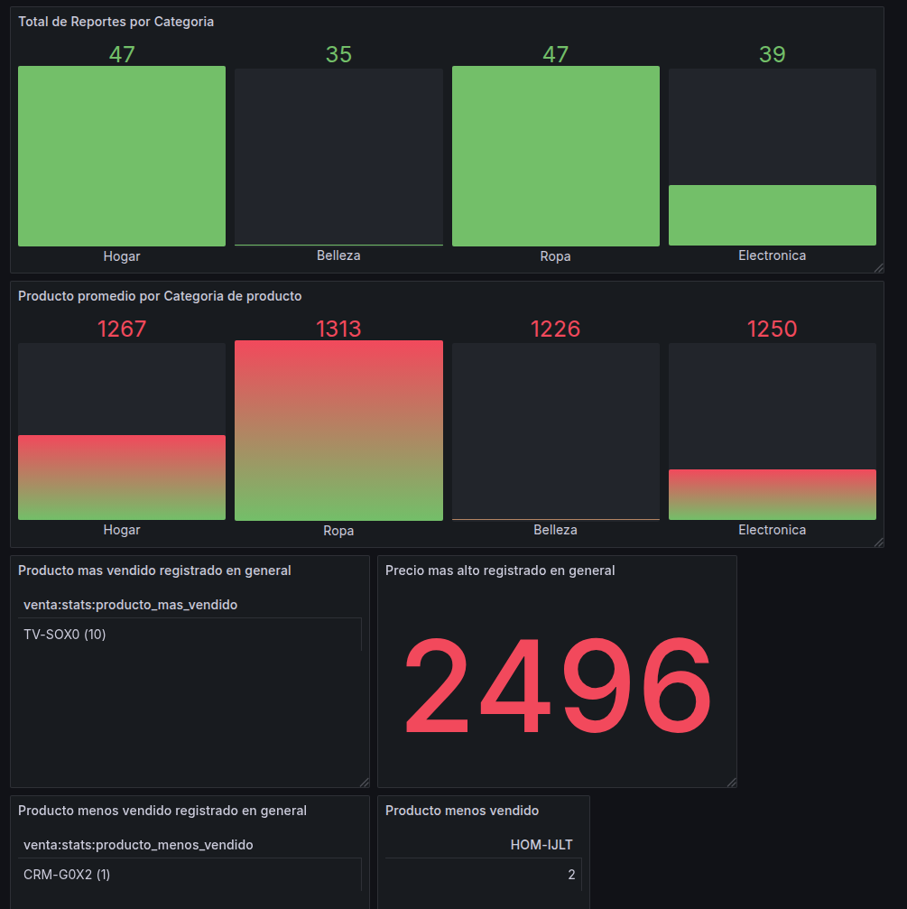

**INFORME TÉCNICO**

Sistema “Blackfriday” desplegado en Kubernetes (Minikube/GKE-compatible) con Zot Registry externo, Kafka, Valkey (KubeVirt) y Grafana

Este proyecto implementa un sistema distribuido orientado a microservicios que procesa tráfico generado por Locust, expuesto mediante Ingress. Las solicitudes llegan a una API REST en Rust, la cual reenvía la carga a componentes en Go que actúan como cliente gRPC y publicadores hacia Kafka. Un consumidor procesa los mensajes y persiste los datos en Valkey. Finalmente, Grafana visualiza métricas/datos desde Valkey mediante un datasource Redis/Valkey. Todas las imágenes Docker se almacenan y distribuyen desde un registry Zot alojado en una VM fuera del clúster.

**Zot Registry (VM externa a Kubernetes)**

Zot se aloja en una VM de GCP fuera del clúster.

Kubernetes hace pull desde Zot al crear pods esto asegura independencia del clúster y un flujo tipo “registry enterprise”.

VM en Google Cloud:

Imagenes alojadas en Zot:

El sistema utiliza las siguientes tecnologias:

**Locust**

Su objetivo es simular carga controlada y escalable contra el punto de entrada del sistema (Ingress)

Cada request contiene un JSON con estructura obligatoria:

-categoria

-producto

-precio

-cantidad_vendida

**Deployments Rust (API REST)**

Este componente recibe la petición, valida/transforma el JSON, reenvía el payload hacia el componente Go (API REST y gRPC Client), Debe soportar alta carga y escalar con HPA, Escalamiento obligatorio: 1 a 3 réplicas con umbral CPU > 30%.

**Deployments Go**

Se implementan tres despliegues lógicos:

**1. Deployment 1: Go (API REST + gRPC Client)**

Recibe solicitudes desde Rust y actúa como cliente gRPC hacia el/los servidores gRPC, tambien invoca funciones para publicar mensajes (indirectamente vía server/writers) hacia Kafka.

**2. Deployment 2 y 3: Go (gRPC Server + Writers)**

Exponen endpoint gRPC, procesan llamadas desde el cliente, tambien publican mensajes hacia Kafka (Kafka writer)y cuenta con pruebas obligatorias con 1 y 2 réplicas para validar escalamiento y balanceo.

**Kafka (Strimzi)**

Deployment/cluster de Kafka implementado con Strimzi.

Su función es almacenar mensajes publicados, y distribuirlos al consumidor.

Kafka funciona como capa de desacoplamiento para tolerancia a picos y buffering.

**Deployment Consumidor Kafka**

Un deployment consumidor consume mensajes desde Kafka, extrae los campos del JSON , persiste la información en Valkey.

Es el componente que asegura que el dato termine almacenado en la base (Valkey).

**Deployments Valkey con persistencia y replicación**

Valkey se despliega con persistencia garantizada cuenta con 2 réplicas por defecto almacenamiento persistente asegurado (disco/volume).

**Deployment Grafana (visualización)**

Grafana se despliega en Kubernetes como Deployment + Service + (opcional) Ingress.

Visualiza datos conectándose a Valkey mediante plugin Redis datasource.

**ARQUITECTURA DEL SISTEMA**

1 Flujo de entrada

Locust envía HTTP al Ingress (ej. http://api.local).

Ingress NGINX enruta al Service del API Rust.

Rust API REST procesa y reenvía al Go Deployment 1.

Go API REST + gRPC Client invoca gRPC Server.

gRPC Server/Writers publica eventos en Kafka.

2 Flujo de mensajería y persistencia

Kafka recibe y retiene mensajes.

Kafka Consumer consume los mensajes y guarda en Valkey.

3 Observabilidad de datos

Grafana consulta Valkey mediante datasource Redis/Valkey y muestra dashboards.

**Componentes Kubernetes (tipos de recursos)**

Los componentes se implementan con:

Deployment: Rust, Go Client, Go Server, Consumer, Grafana

Service (ClusterIP): exponer internamente cada app

Ingress (NGINX): exponer API y Grafana por hostname

HPA: escalamiento automático para Rust (y opcionalmente otros)

Kafka (Strimzi): CRDs (Kafka, KafkaTopic, etc.)

KubeVirt: VirtualMachine / VirtualMachineInstance para Valkey

datasource de Grafana (provisioning)

**Funcionamiento**
Inicialmente se despliega miniKube para iniciar todos los kubernetes con el siguiente comando en linux:

*minikube start*

para iniciar todos las imagenes en kubernetes ingresamos a la ruta Proyecto2_sopes1/k8s e ingresamos el siguiente comando:

*kubectl apply -f .*

Se verfica los estados de los Pods con el siguiente comando:

*kubectl get pods -A*

Los siguientes pods deben estar en estado "Running": 

Prueba de entrada por Ingress

Validar que la API responde por hostname:

*curl http://api.local/...*

Se debe iniciar Locust ingresando al directorio de ../Locust y usar el siguiente comando: 
 *locust -H http://192.168.49.2:31244*

para poder ingresar a la pagina web que corresponde :

 Validación de HPA

para poder ver el HPA en consola escribimos:

*kubectl get hpa*

se recomienda forzar carga con Locust y verificar incremento de réplicas.

En la consola se visualiza la cantidad de replicas y el porcentaje de cpu:

Ingreso a Grafana:
Los dashboards de Grafana nos permite poder visualizar todos los datos guardados en valkey:

Conclusión

El sistema implementa un flujo completo de generación de carga → ingestión → procesamiento → mensajería → persistencia → visualización, cumpliendo los requisitos obligatorios del documento: uso de Locust con JSON definido, escalamiento HPA en Rust, pipeline Go/gRPC, Kafka, consumidor con persistencia en Valkey replicado, Grafana para dashboards y Zot como registry externo en VM.